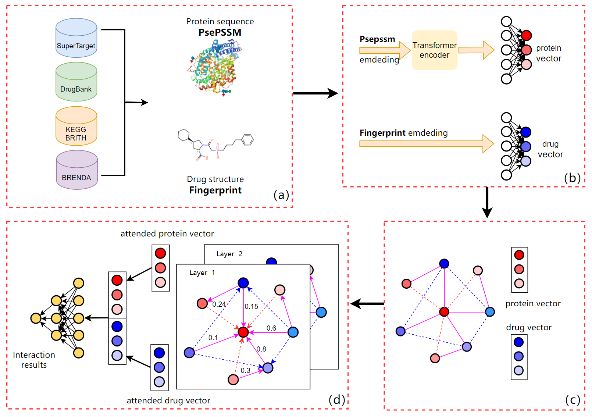

# MHNF-DTI: Heterogeneous Network Framework for Drug-Target Interaction Prediction

This repository provides the implementation of our paper: "[MHNF-DTI: Multi-domain based Heterogeneous Network Framework for Drug-Target Interaction Prediction]" .

<p align='center'>
    
</p>

## Required Packages

* Python 3.6.5 (or a compatible version)
* Pytorch 1.1.0
* NumPy 1.17.3 (or a compatible version)
* Pytorch_geometric 1.3.2
* tqdm 4.41.1 (or a compatible version)
* scikit-learn 0.21.3 (or a compatible version)

## Updates

* Apr 2023: We update the code

## Experimental Datasets and Settings

Please see the datasets in [`data/`](data/) with detailed instructions.


## General Instructions

1. Configuration environment
2. Prepare datasets for K-fold cross-validation following the designated JSON format as shown in the section of data preparation.
3. Set corresponding hyperparameter according to and conduct experiments.


## Configuration environment
We recommend using Pytorch-geometric official "[docker image](https://github.com/rusty1s/pytorch_geometric/tree/master/docker)"

Pytorch-geometric official documentation "[installation](https://pytorch-geometric.readthedocs.io/en/latest/notes/installation.html)"

## Data Preparation

### Data Description

The four dataset are available in ['data/'](data/)

The preprocess file is [`processdata.py`](processdata.py). A directory `preporcess/` will be generated ,which contains 
preprocess adjacent matrix and train/val interaction index.

### Data Format
#### Original Data
A npz file that contains protein vectors, drug fingerprints and interaction labels

Crossvalidation data
```
files:
  "pssm_arr": a protein vector with 220 length,
  "drug_arr": a drug fingerprint with 881 length,
  "int_ids": [p_id, d_id, 0 or 1], interaction label
  "folds": 5 folds crossvalication, decided with fold they belong to
  "train_ids": train sample index of int_ids
  "val_ids": val sample index of int_ids
```
* **"pssm_arr"** is the protein vector generated by PsePSSM.
* **"drug_arr"** is the drug fingerprint.
* **"int_ids"** maps to the label for this DTPs, either 0 or 1.
* **"folds"** maps instance to the fold. 
* **"train_ids"** maps train instance to the int_ids, which exist in the cross-domain label reversal dataset.
* **"val_ids"** maps val instance to the int_ids,which exist in the cross-domain label reversal dataset..

####Preprocess data
A json file that contains transform adjacent matrix, DTI interaction Mat and train/val index.
```
keys:
  "adj": transform adjacent matrix,
  "dti_inter": a mat contain either 0 or 1，
  "train_interact_pos": [p_id, d_id]
  "test_interact_pos": [p_id, d_id], the test index of dti_interact_mat
```
* **"adj"** is transform adjacent matrix with shape [node_number, node_number]
* **"dti_inter"** is a mat contain either 0 or 1 with shape [protein_number, drug_number]
* **"train_interact_pos"** [p_id, d_id] the train index of dti_interact_mat
* **"val_interact_pos"** [p_id, d_id] the val index of dti_interact_mat

### Generation Script
If you use docker (recommend):
```
$ nvidia-docker run -it --user $(id -u):$(id -g) --name='DTI' -v ${pwd}:/app/ ${image_name}
```
* ${pwd} can be replaced by current path, ${image name} can be replace by pytorch geometric image name, such as py_geometric.

For the convinience, the script [`processdata.py`](processdata.py) can be utilized to generate the preprocess data from original data. 

The following command is an example
```
$ python ./processdata.py --dataset enzyme --crossval 1 --start_epoch 0 --end_epoch 2000 --common_neighbor 3 --adj_norm True --data_root ./data
```
* crossval decide if use crossvalidation, if crossval == 1, generate 5 fold, else 0.


If you want to generate the preprocess data for the cross-domain label reversal dataset, you can use the following script:

```
$ python ./processdata.py --dataset cross_reverse --crossval 0 --start_epoch 0 --end_epoch 2000 --common_neighbor 3 --adj_norm True --data_root ./data
```

## Training, Testing, and Evaluation


### Hyper-parameters and experimental setttings through command line options.

The command line options of our implementation can assign all of the expeirmental setups and model hyper-parameters, which are as follows:

```
# Training settings
parser = argparse.ArgumentParser(description='DTI-GRAPH')
parser.add_argument('--dropout', type=float, default=0.3,  
                 help='Dropout rate (1 - keep probability).')
parser.add_argument('--gat_nheads', type=int, default=6, 
                    help='GAT layers')
parser.add_argument('--no-cuda', action='store_true', default=False,
                    help='Disables CUDA training.')
parser.add_argument('--seed', type=int, default=223, help='Random seed.')
parser.add_argument('--epochs', type=int, default=4000,
                    help='Number of epochs to train.')
parser.add_argument('--lr', type=float, default=0.0005,
                    help='Initial learning rate.')
parser.add_argument('--weight_decay', type=float, default=5e-3,
                    help='Weight decay (L2 loss on parameters).')
parser.add_argument('--if_save', type=bool, default=True,
                    help='Weight decay (L2 loss on parameters).')
###############################################################
# Model hyper setting
# Protein_NN
parser.add_argument('--protein_ninput', type=int, default=220,
                    help='protein vector dimension')
parser.add_argument('--pnn_nlayers', type=int, default=1,
                    help='Protein_nn layers num')
parser.add_argument('--pnn_nhid', type=str, default='[]',
                    help='pnn hidden layer dim, like [200,100] for tow hidden layers, three pnn_nlayers')
# Drug_NN
parser.add_argument('--drug_ninput', type=int, default=881,
                    help='Drug fingerprint dimension')
parser.add_argument('--dnn_nlayers', type=int, default=1,
                    help='dnn_nlayers num')
parser.add_argument('--dnn_nhid', type=str, default='[]',
                    help='dnn hidden layer dim, like [200,100] for tow hidden layers, three dnn_nlayers')
# GAT
parser.add_argument('--gat_type', type=str, default='PyG',
                    help="two different type, 'PyG Sparse GAT'(PyG) and 'Dense GAT Self'(Dense-Self)")
parser.add_argument('--gat_ninput', type=int, default=256,
                    help='GAT node feature length, is also the pnn  outpu size and dnn output size')
parser.add_argument('--gat_nhid', type=int, default=256,
                    help='hidden dim of gat')
parser.add_argument('--gat_noutput', type=int, default=256,
                    help='GAT output feature dim and the input dim of Decoder')
parser.add_argument('--gat_negative_slope', type=float, default=0.2,
                    help='GAT LeakyReLU angle of the negative slope.')
# Decoder
parser.add_argument('--DTI_nn_nlayers', type=int, default=3,
                    help='Protein_nn layers num')
parser.add_argument('--DTI_nn_nhid', type=str, default='[256,256,256]',
                    help='DTI_nn hidden layer dim, like [200,100] for tow hidden layers')
###############################################################
# data
parser.add_argument('--crossvalidation', type=int, default=1,
                    help='whether use crossvalidation or not')
parser.add_argument('--dataset', type=str, default='cross_reverse', 
                    help='dataset name')
parser.add_argument('--common_neighbor', type=int, default=3,
                    help='common neighbor of adj transform, this will determine what preprocessed matrix you use')
parser.add_argument('--sample_num', type=int, default=300,
                    help='different epoch use different sample, the sample num')
parser.add_argument('--data_path', type=str, default='./data',
                    help='dataset root path')
```

### Training and Testing with Evaluation

Both training and testing procedures can be achived by the script [`train.py`](train.py) with the above options. For example, we can execution the following command:

Crossvalidation
```
$ CUDA_VISIBLE_DEVICES=0 python train.py --data_path ./data --epoch 10000 --lr 0.0005 \
--dataset enzyme --sample_num 2000 --dropout 0.3 --model_dir enzyme_com3_gn2\
--crossvalidation 1 --common_neighbor 3 --gat_nheads 2 --gat_ninput 256 --gat_nhid 256 \
--gat_noutput 256 --DTI_nn_nlayers 3 --DTI_nn_nhid [256,256,256]
```

Train and Val（Crossval setting must be matched to processdata.py）
```
$ CUDA_VISIBLE_DEVICES=0 python train.py --data_path ./data --epoch 10000 --lr 0.0005 \
--dataset enzyme --sample_num 2000 --dropout 0.3 --model_dir enzyme_com3_gn2\
--crossvalidation 0 --common_neighbor 3 --gat_nheads 2 --gat_ninput 256 --gat_nhid 256 \
--gat_noutput 256 --DTI_nn_nlayers 3 --DTI_nn_nhid [256,256,256]
```
Note the format model save dir as:
```
[
  fold id:
    [model_state and document txt]
  document.txt:
    document the accury, precision, recall, mcc, auc, aupr and so on  
]
```
  
### Citation
If you find our code is helpful for you, feel free to cite
```

```

### Contact us
hpc@neau.edu.cn


